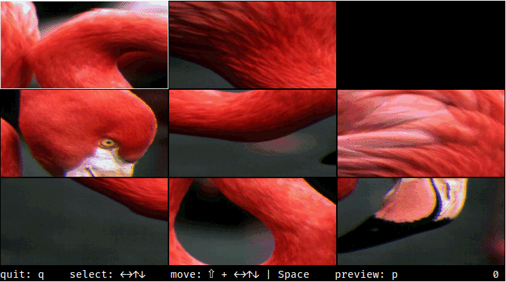

## puzzle - image puzzle with sixels in the terminal

Needs python3 with Pillow and `img2sixel` in PATH, and a terminal emulator with SIXEL support with at least 256 colors.

Example screenshot (from xterm.js):

Enjoy!

### Tested with:

- xterm -ti vt340
- xterm.js (with xterm-addon-image)
- mlterm
- contour
- WezTerm

### Possible Enhancements:

- Resize image with keeping the aspect ratio. Currently it gets simply stretched to full terminal space.
- Image rendering is quite slow currently due to full SIXEL recreation everytime. Performance would benefit alot with either transparent diff updates (transparency not supported in my libsixel version), or at least by doing smaller partial screen updates (hard to get working across emulators with proper pixel alignment).
- Even puzzles > 2 dont work yet (still missing the solvability maths).
- Respect SIGWINCH. Currently size calc is only done once initially.
- Mouse support would be nice (for point&click moves).

